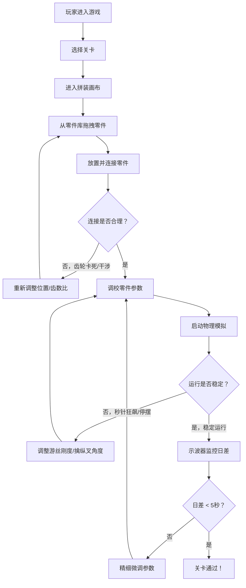

# 钟表擒纵机构物理沙盒 - 产品需求文档 (PRD)

## 1. 产品概述

一款硬核 2D 机械物理沙盒游戏，让玩家通过拼装齿轮、游丝、擒纵叉和摆轮等精密零件，设计并调校一个能稳定运行的机械钟表机芯。游戏的核心乐趣在于物理仿真的精准度和调校过程的工匠精神。

- 目标用户：机械爱好者、钟表发烧友、物理模拟游戏玩家
- 核心价值：通过高精度物理仿真，让玩家体验真实机械钟表的设计与调校过程

## 2. 核心功能

### 2.1 功能模块

1. **主游戏画布**：2D 物理画布，支持零件拖拽、放置、连接和运行模拟
2. **零件库面板**：提供各类基础机械零件供玩家选择
3. **示波器面板**：实时显示摆轮振幅曲线和日差计算
4. **参数调校面板**：调节零件的位置、质量、弹簧系数等参数
5. **关卡系统**：多关卡挑战，限定零件数量和精度要求
6. **音效系统**：齿轮咬合、擒纵滴答的清脆音效

### 2.2 页面详情

| 页面名称 | 模块名称 | 功能描述 |
|---------|---------|---------|
| 游戏主界面 | 零件库面板 | 展示可拖拽的机械零件：齿轮(多种齿数)、游丝、擒纵叉、摆轮、发条盒、传动轴、夹板 |
| 游戏主界面 | 2D 画布 | 玩家拼装区域，支持拖拽放置、旋转对齐、轴连接、齿轮啮合自动检测 |
| 游戏主界面 | 示波器面板 | 左上角实时绘制：摆轮振幅-时间曲线、频率频谱、实时日差读数、能量储备指示 |
| 游戏主界面 | 参数调校面板 | 选中零件后显示：坐标微调、质量/转动惯量、弹簧刚度、齿轮啮合深度、擒纵叉角度 |
| 游戏主界面 | 状态栏 | 运行/暂停/重置按钮、当前关卡、使用零件数/上限、日差达标状态指示 |
| 关卡选择页 | 关卡列表 | 显示各关卡解锁状态、零件限制、目标精度（日差<5秒等）、推荐结构提示 |
| 关卡选择页 | 教程引导 | 基础机械原理教学：齿轮传动比、摆轮等时性、擒纵机构工作原理 |

## 3. 核心流程

### 物理仿真核心流程

1. **初始化阶段**：玩家放置零件 → 系统建立约束关系（旋转轴、齿轮啮合比、弹簧连接）
2. **积分阶段**：每帧使用龙格-库塔法求解刚体旋转运动方程（τ = Iα）
3. **约束求解**：齿轮啮合约束、擒纵叉-摆轮碰撞检测、游丝恢复力矩计算
4. **数据采集**：记录摆轮角度、角速度 → 计算振幅、频率、日差 → 示波器绘制

## 4. 用户界面设计

### 4.1 设计风格

**复古铜板蚀刻 / 黄铜金属质感**

- **主色调**：黄铜金 `#B8860B`、深铜绿 `#2F4F4F`、旧化黑 `#1C1C1C`、象牙白 `#FFFFF0`
- **辅助色**：红宝石轴承红 `#DC143C`、蓝钢螺丝蓝 `#4682B4`
- **字体**：
  - 标题：复古衬线字体（Cinzel 或 Trajan Pro 风格）
  - 正文：古典等宽字体（Courier Prime 或 IBM Plex Mono）
- **材质纹理**：
  - 背景：深色铜板蚀刻纹理，带细密同心圆花纹
  - 齿轮：黄铜拉丝金属质感，边缘高光，齿面磨损纹理
  - 面板：做旧黄铜边框，铆钉装饰，刻度蚀刻效果
- **按钮风格**：黄铜浮雕按钮，按下时有凹陷效果，带微光晕
- **图标风格**：机械线稿风，精密制图感

### 4.2 页面设计概览

| 页面名称 | 模块名称 | UI 元素 |
|---------|---------|---------|
| 游戏主界面 | 2D 画布 | 深色铜板背景带细密网格、黄铜边框铆钉、可拖拽零件带磁吸对齐辅助线 |
| 游戏主界面 | 示波器面板 | CRT 扫描线效果、绿色荧光曲线、蚀刻刻度线、红宝石装饰螺丝 |
| 游戏主界面 | 零件库 | 黄铜抽屉式分类收纳、零件图标带阴影和高光、悬浮放大预览 |
| 游戏主界面 | 参数面板 | 螺旋测微器风格旋钮、游标卡尺式刻度尺、蓝钢螺丝装饰 |
| 关卡选择页 | 列表 | 怀表表盘式设计、每个关卡为一个子表盘、通过后镶金装饰 |

### 4.3 响应式设计

- 桌面端优先设计，最低分辨率 1280×800
- 画布区域自适应窗口大小，保持 4:3 或 16:9 比例
- 面板可折叠/展开，支持键盘快捷键

### 4.4 动效设计

- 零件放置：磁吸吸附动画，轻微缩放反馈
- 齿轮咬合：咬合瞬间有金属闪光效果
- 擒纵动作：滴答声配合擒纵叉微小震动动画
- 日差达标：示波器绿色闪烁 + 黄铜装饰点亮
- 失败效果：齿轮卡死时有金属摩擦火花 + 警报音

## 5. 核心零件规格

| 零件类型 | 可调参数 | 物理特性 |
|---------|---------|---------|
| 齿轮 | 齿数(8-120)、模数、位置、转动惯量 | 传动比 = 从动齿数/主动齿数；啮合检测基于节圆距离 |
| 游丝 | 刚度系数、有效圈数、内端固定角 | 恢复力矩 τ = -k·θ；与摆轮构成谐振系统 T=2π√(I/k) |
| 摆轮 | 转动惯量、摆幅极限、初始角度 | 谐振子核心；与游丝配合决定走时频率 |
| 擒纵叉 | 叉瓦角度、锁面深度、冲面角度 | 控制能量释放节奏；与摆轮圆盘钉碰撞 |
| 发条盒 | 初始能量、最大力矩、力矩衰减曲线 | 能量来源；力矩随放条递减，影响振幅稳定性 |
| 传动轴 | 位置、摩擦系数 | 旋转约束；摩擦导致能量损耗 |
