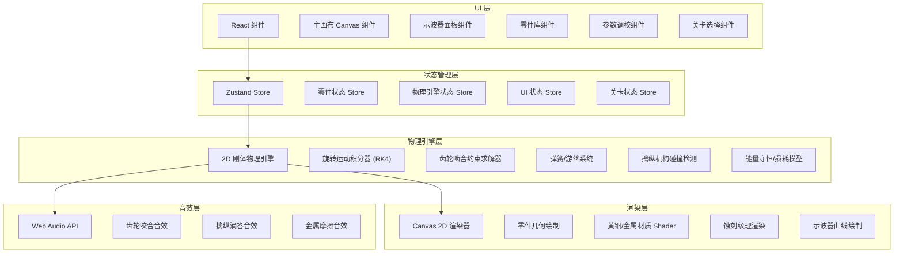

# 钟表擒纵机构物理沙盒 - 技术架构文档

## 1. 架构设计



## 2. 技术选型

- **前端框架**：React 18 + TypeScript
- **构建工具**：Vite 5
- **样式方案**：Tailwind CSS 3 + 自定义 CSS 变量（金属质感主题）
- **状态管理**：Zustand
- **物理引擎**：自研 2D 旋转刚体物理引擎（非通用物理引擎，针对钟表机构优化）
- **渲染**：HTML5 Canvas 2D API
- **音效**：Web Audio API（程序化合成，无需音频资源文件）
- **路由**：React Router DOM

## 3. 目录结构

```
src/
├── components/           # React 组件
│   ├── canvas/          # 画布相关
│   │   ├── GameCanvas.tsx
│   │   ├── Oscilloscope.tsx
│   │   └── PartRenderer.ts
│   ├── ui/              # UI 面板
│   │   ├── PartsLibrary.tsx
│   │   ├── ParamTuner.tsx
│   │   ├── StatusBar.tsx
│   │   └── BrassButton.tsx
│   └── pages/           # 页面
│       ├── GamePage.tsx
│       └── LevelSelectPage.tsx
├── physics/             # 物理引擎核心
│   ├── types.ts         # 物理类型定义
│   ├── engine.ts        # 物理引擎主循环
│   ├── integrator.ts    # RK4 运动积分器
│   ├── constraints.ts   # 约束求解（齿轮啮合、旋转轴）
│   ├── springs.ts       # 弹簧/游丝系统
│   ├── escapement.ts    # 擒纵机构逻辑
│   └── collision.ts     # 碰撞检测
├── store/               # Zustand 状态管理
│   ├── partsStore.ts    # 零件状态
│   ├── physicsStore.ts  # 物理状态
│   └── uiStore.ts       # UI 状态
├── hooks/               # 自定义 Hooks
│   ├── usePhysicsLoop.ts
│   ├── useDragDrop.ts
│   └── useAudio.ts
├── audio/               # 音效系统
│   ├── audioEngine.ts
│   └── soundSynth.ts    # 程序化音效合成
├── data/                # 关卡与配置数据
│   ├── levels.ts
│   └── partsPresets.ts
├── utils/               # 工具函数
│   ├── math.ts          # 数学工具（向量、矩阵、插值）
│   └── drawing.ts       # Canvas 绘制辅助
├── types/               # 全局类型定义
│   └── index.ts
├── styles/              # 全局样式
│   ├── theme.css        # 金属质感主题变量
│   └── global.css
├── App.tsx
├── main.tsx
└── index.css
```

## 4. 核心数据模型

### 4.1 零件类型定义

```typescript
// 零件基础类型
interface BasePart {
  id: string;
  type: PartType;
  x: number;           // 中心 X 坐标
  y: number;           // 中心 Y 坐标
  rotation: number;    // 初始角度 (弧度)
  mass: number;        // 质量
  inertia: number;     // 转动惯量
}

type PartType = 'gear' | 'spring' | 'balance' | 'escapement' | 'barrel' | 'shaft' | 'hand';

// 齿轮
interface GearPart extends BasePart {
  type: 'gear';
  teeth: number;       // 齿数
  module: number;      // 模数 (决定齿大小)
  pitchRadius: number; // 节圆半径
  connectedTo: string[]; // 啮合的齿轮 ID 列表
}

// 游丝（摆轮弹簧）
interface SpringPart extends BasePart {
  type: 'spring';
  stiffness: number;   // 扭转刚度 k
  coils: number;       // 有效圈数
  innerAnchor: string; // 内端固定的零件ID (摆轮)
  outerAnchor: string; // 外端固定的零件ID (夹板)
}

// 摆轮
interface BalancePart extends BasePart {
  type: 'balance';
  amplitudeLimit: number; // 最大摆幅 (弧度)
  currentAngle: number;   // 当前角度
  currentVelocity: number; // 当前角速度
}

// 擒纵叉
interface EscapementPart extends BasePart {
  type: 'escapement';
  palletAngle: number;    // 叉瓦角度
  lockDepth: number;      // 锁面深度
  impulseAngle: number;   // 冲面角度
  connectedWheel: string; // 连接的擒纵轮 ID
  connectedBalance: string; // 连接的摆轮 ID
}

// 发条盒
interface BarrelPart extends BasePart {
  type: 'barrel';
  energy: number;         // 当前能量储备 (0-1)
  maxTorque: number;      // 最大力矩
  torqueCurve: number[];  // 力矩衰减曲线
}

// 指针
interface HandPart extends BasePart {
  type: 'hand';
  handType: 'hour' | 'minute' | 'second';
  connectedGear: string;  // 驱动齿轮
  gearRatio: number;      // 传动比
}
```

### 4.2 物理状态

```typescript
interface PhysicsState {
  running: boolean;
  timeScale: number;        // 时间缩放 (模拟速度倍率)
  elapsedTime: number;      // 已模拟时间 (秒)
  realTime: number;         // 真实时间 (秒) - 用于计算日差
  parts: Record<string, PartState>;
  constraints: Constraint[];
}

interface PartState {
  angle: number;            // 当前角度 (弧度)
  angularVelocity: number;  // 角速度 (弧度/秒)
  angularAcceleration: number; // 角加速度
  appliedTorque: number;    // 合外力矩
}

interface Constraint {
  type: 'gear_mesh' | 'shaft' | 'spring' | 'escapement_lock';
  partA: string;
  partB: string;
  params: Record<string, number>;
}
```

## 5. 物理引擎核心算法

### 5.1 旋转运动积分（RK4 四阶龙格-库塔法）

```
每帧 (dt = 1/60 秒):
对于每个旋转刚体:
  k1_ω = torque / inertia
  k1_θ = angularVelocity
  
  k2_ω = (torque + torqueAt(θ + 0.5*dt*k1_θ, ω + 0.5*dt*k1_ω)) / inertia
  k2_θ = angularVelocity + 0.5*dt*k1_ω
  
  k3_ω = (torque + torqueAt(θ + 0.5*dt*k2_θ, ω + 0.5*dt*k2_ω)) / inertia
  k3_θ = angularVelocity + 0.5*dt*k2_ω
  
  k4_ω = (torque + torqueAt(θ + dt*k3_θ, ω + dt*k3_ω)) / inertia
  k4_θ = angularVelocity + dt*k3_ω
  
  θ += (dt/6) * (k1_θ + 2*k2_θ + 2*k3_θ + k4_θ)
  ω += (dt/6) * (k1_ω + 2*k2_ω + 2*k3_ω + k4_ω)
```

### 5.2 齿轮啮合约束

```
两齿轮啮合条件:
  中心距 d = r1 + r2 (节圆半径之和)
  传动比 ω2 = -ω1 * (z1/z2)  (负号表示反向旋转)
  
约束求解 (每帧迭代):
  计算速度误差: error = ω1*r1 + ω2*r2 (理想啮合时应为0)
  施加校正力矩: τ_correction = -Kp * error - Kd * derivative(error)
  分配给两齿轮: τ1 = τ_correction, τ2 = -τ_correction * (z2/z1)
```

### 5.3 游丝-摆轮谐振系统

```
游丝恢复力矩: τ_spring = -k * θ - c * ω
  k: 弹簧刚度
  c: 阻尼系数
  θ: 摆轮相对平衡位置的角度
  ω: 角速度

固有频率: f₀ = (1/2π) * √(k/I)
  I: 摆轮转动惯量

理想频率: 2Hz (4Hz 节拍) → 每秒 4 次滴答 → 日差 = (实际频率 - 4Hz) × 86400 秒
```

### 5.4 擒纵机构能量释放

```
每个周期 (摆轮来回一次):
  1. 摆轮到达极限位置 → 圆盘钉冲击擒纵叉 → 释放一个齿
  2. 擒纵轮前进一齿 → 冲面给摆轮补充能量
  3. 另一叉瓦锁住擒纵轮 → 等待下一周期

能量补充:
  每次滴答: ΔE = impulse_force × impulse_distance
  目标: ΔE ≈ 摩擦损耗能量 → 振幅稳定
```

### 5.5 日差计算

```
日差 = (实际走时时长 - 标准时长) × (86400 / 观测时长)

实际走时时长: 基于秒针齿轮累计转数
标准时长: 真实经过时间
观测时长: 至少 30 个摆轮周期以获得稳定读数
```

## 6. 渲染系统

### 6.1 金属质感实现

使用 Canvas 2D 的渐变、阴影和滤镜组合实现黄铜质感：

```typescript
// 黄铜金属渐变
const brassGradient = ctx.createRadialGradient(x, y, r*0.1, x, y, r);
brassGradient.addColorStop(0, '#DAA520');   // 亮金
brassGradient.addColorStop(0.3, '#B8860B'); // 黄铜
brassGradient.addColorStop(0.7, '#8B6914'); // 暗铜
brassGradient.addColorStop(1, '#5C4A1F');   // 阴影

// 蚀刻纹理：使用离屏 Canvas 叠加 noise 图案
ctx.globalCompositeOperation = 'overlay';
ctx.drawImage(etchingTexture, 0, 0);
ctx.globalCompositeOperation = 'source-over';
```

### 6.2 齿轮绘制算法

```typescript
function drawGear(ctx, x, y, teeth, module, rotation) {
  const r = teeth * module / 2;  // 节圆半径
  const addendum = module;       // 齿顶高
  const dedendum = 1.25 * module; // 齿根高
  const ra = r + addendum;       // 齿顶圆
  const rf = r - dedendum;       // 齿根圆
  
  ctx.beginPath();
  for (let i = 0; i < teeth; i++) {
    const angle = rotation + (i / teeth) * Math.PI * 2;
    // 使用渐开线近似绘制齿形
    drawToothProfile(ctx, x, y, angle, r, ra, rf, module);
  }
  ctx.closePath();
  ctx.fill();
  ctx.stroke();
}
```

## 7. 音效合成方案

使用 Web Audio API 程序化合成清脆的机械音效：

### 7.1 滴答声（擒纵动作）

```
载波: 3-5kHz 正弦波
包络: 快速冲击 (attack 1ms) → 指数衰减 (release 30-50ms)
滤波: 高通滤波 (2kHz) 去除低频浑浊
```

### 7.2 齿轮咬合声

```
短促噪声脉冲 (白噪声)
包络: attack 0.5ms, release 5-10ms
滤波: 带通滤波 (中心频率 8kHz, Q=5)
触发: 齿轮啮合点经过时触发
```

## 8. 性能优化策略

1. **物理子步长**：每帧运行 4-8 次子步长积分，保证齿轮啮合稳定性
2. **空间分区**：使用网格空间哈希加速齿轮碰撞检测
3. **脏矩形渲染**：仅重绘移动零件所在区域
4. **对象池**：复用临时计算对象避免 GC 卡顿
5. **离屏 Canvas**：静态黄铜纹理和蚀刻图案预渲染缓存
